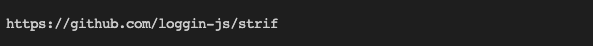
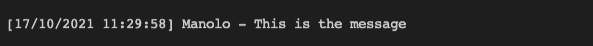

<!-- Links -->
[npm-image]: https://img.shields.io/npm/v/strif.svg?style=flat-square
[npm-url]: https://npmjs.org/package/strif

[code-quality-badge]: http://npm.packagequality.com/shield/strif.svg?style=flat-square
[code-quality-link]: https://packagequality.com/#?package=strif

[downloads-badge]: https://img.shields.io/npm/dm/strif.svg?style=flat-square
[downloads-link]: https://www.npmjs.com/package/strif

[dependencies-badge]: https://img.shields.io/david/nombrekeff/strif.svg?style=flat-square
[dependencies-link]: https://david-dm.org/nombrekeff/strif?view=tree

[vulnerabilities-badge]: https://snyk.io/test/npm/strif/badge.svg?style=flat-square
[vulnerabilities-link]: https://snyk.io/test/npm/strif

<div align="center">

# :card_index: strif <!-- omit in toc -->

[![NPM version][npm-image]][npm-url]
[![Downloads][downloads-badge]][downloads-link]
[]()  
[![Dependencies][dependencies-badge]][dependencies-link]
[![Known Vulnerabilities][vulnerabilities-badge]][vulnerabilities-link]

<p>Utility for interpolating strings from a template with some data.</p>
</div>

****

## Features <!-- omit in toc -->
* ✔︎ Simple
* ✔︎ Expandable/Configurable
* ✔︎ Type Checking
* ✔︎ No Dependencies

## Introduction
**Strif** was initially created for one of my other libraries [Loggin'JS]() which needed some features I could not find in other libraries and decided to do it myself.

What I needed was to be able to **process a string in segments**, and apply some **format** to each segment, with the option to **enable/disable** which parts are formatted and which parts are not. 

For example:
* Formating log messages, where some part need to be colored, some need to be converted to a specific date format. Etc... 
* Filling in a string with any data

Most simple example, so you get an idea:

```js
const githubRepoLink = strif
  .template('https://github.com/{owner}/{repo}')
  .compile({ owner: 'loggin-js', repo: 'strif' });

console.log(githubRepoLink);
```
The above example would output the following:


## Table Of Content <!-- omit in toc -->
- [Introduction](#introduction)
- [Installation](#installation)
- [Importing](#importing)
- [Usage](#usage)
  - [Using in Node](#using-in-node)
  - [Using in Browser](#using-in-browser)
- [Examples](#examples)
  - [Fill slug with data](#fill-slug-with-data)
  - [Formatting a log message](#formatting-a-log-message)
- [Api](#api)
  - [strif](#strif)
    - [strif.Formatter](#strifformatter)
    - [strif.Template](#striftemplate)
    - [strif.Prop](#strifprop)
    - [strif.PropOptions](#strifpropoptions)
    - [strif.TemplateOptions](#striftemplateoptions)
    - [strif.FormatterOptions](#strifformatteroptions)
  - [Transformers](#transformers)
  - [Plugins](#plugins)
- [Found a bug or have a feature request](#found-a-bug-or-have-a-feature-request)
- [Contributing](#contributing)

## Installation
Install from npm:
```
$ npm install strif
```

## Importing
With require: 
```js
const strif = require('strif');
```

With ES6 import:
```js
import strif from 'strif';
```

In the browser:
```html
<script src="node_modules/strif/dist/strif.dist.js"></script>
```
> ! NOTICE: Plugins currently don't work in browser, woking on it. PRs Welcome

## Usage
### Using in Node
Using **strif** is actually pretty easy, you can use the default formatter under **strif**. This formatter contains a set of predefined formatters (_if you want to add you custom formatters, see the next point_)

```js
let template = strif.template('{time} {user} {message}');
template.compile(data);

// Or
strif.compile('{time} {user} {message}', data);
```

or create a custom one by using `strif.create(opts)`, you can pass a set of [transformers](#transformers), [plugins](#plugins) and other [options](#strifformatteroptions)

```js
const formatter = strif.create({
  transformers: {
    date: s => new Date(s),
    lds:  d => d.toLocaleString()
  }
});

let template = formatter
  .template('{time} {user} {message}')
  .prop('time', { transformers: [`date`] });

let formatterString = 
  template.compile({
    time: 11223322,
    message: 'This is a super long message ',
    user: { name: 'Bob' }
  });

console.log(formatterString);
```

### Using in Browser
Using **strif** in the browser is as simple as in node, just import the script `strif/dist/strif.dist.js`
```html
<html lang="en">
  <head>
    <script src="node_modules/strif/dist/strif.dist.js"></script>
  </head>
  <body>
    <script>
      strif.create(); // strif is available
    </script>
  </body>
</html>
```
> ! NOTICE: Plugins currently don't work in browser, woking on it. PRs Welcome


## Examples
I think looking at an example will help understand what strif does better than words:

### Fill slug with data

```js
const githubRepoLink = strif
  .template('https://github.com/{owner}/{repo}')
  .compile({ owner: 'loggin-js', repo: 'strif' });

console.log(githubRepoLink);
```

The above example would output the following:


### Formatting a log message
```js
const template = strif
  .template('[{time}] {user} - {message}', {
    props: {
      // `time` will be treated as a date, and apply the "lds" (toLocaleString) transformer
      time: { transformers: [`date`, `lds`] },

      // `user` specifies the dot notation path to the data ('user.name')
      // transformers can also be functions 
      user: { transformers: [(c) => c.toUpperCase()], accessor: 'user.name' },
    }
  })
  // props can be defined after creating the template, and can also define a type
  .prop('message', { type: 'string' });

// If we want to apply data to the template, we do it by using the `compile()` method
const logMessage = template.compile({
  time: Date.now(),
  user: { name: 'Manolo' },
  message: 'This is the message',
});
```

The above example would output the following:



## Api
### strif
Exported members from `strif`.
```ts
interface strif {
  create(opts: strif.StrifOptions): void;
  Formatter: strif.Formatter;
}
```

#### strif.Formatter
```ts
interface strif.Formatter {
  constructor(opts: strif.FormatterOptions);
  template(template: string, options: strif.TemplateOptions): strif.Template;
  fromFile(path: string, options: strif.TemplateOptions): strif.Template;
}
```

#### strif.Template
```ts
interface strif.Template {
  constructor(template: string, transformers: { [key: string]: (v) => v }, options: strif.TemplateOptions);
  prop(name: string, options: strif.PropOptions): this;
  print(): void;
  compile(data: object, options: { ignoreTransformers: string[] }): string;
}
```

#### strif.Prop
```ts
interface strif.Prop {
  constructor(name, opts: strif.PropOptions);
  getFromObject(obj: object): any;
}
```

#### strif.PropOptions
```ts
interface strif.PropOptions {
  accessor: string;
  type: string;
  transformers: string[];
}
```

#### strif.TemplateOptions
```ts
interface strif.TemplateOptions {
  props: strif.StrifProp[];
}
```

#### strif.FormatterOptions
```ts
interface strif.FormatterOptions {
  transformers: { [key: string]: (v) => v };
  plugins: string[]; 
}
```

### Transformers
Transformers are **functions** that are used to process some segment of the template,  
they will **receive a value** and they **must** also **return a value**, here are some example:
```js
{
  transformers: {
    date: s => new Date(s),
    lds:  d => d.toLocaleString()
  }
}
```


### Plugins
I added a little bit of plugin support, what a plugin actually is, is an object _(for now)_ wich contains transformers _(also for now)_, and will be attached to any [template](#striftemplate) generated by that [transformer](#striftransformer).
Here are some example:
```js
const chalk = require('chalk');
module.exports = {
  transformers: {
    blue:  s => chalk.blue(s),
    gray:  s => chalk.gray(s),
    green: s => chalk.green(s),
  }
};
```
>  Check this [demo](./tests/plugins/strif-color.js) for another example.

## Found a bug or have a feature request
If you found a **bug** or have a **feature request** please dont hesitate on leaving a [issue]()

## Contributing
If you would like to collaborate please check [CONTRIBUTING.md](./CONTRIBUTING.md) for more details.

## Considerations <!-- omit in toc -->
This project was in some way inspired by [@davidchambers/string-format](https://github.com/davidchambers/string-format#formatcreatetransformers), at least in the sense of the transformers concept.
